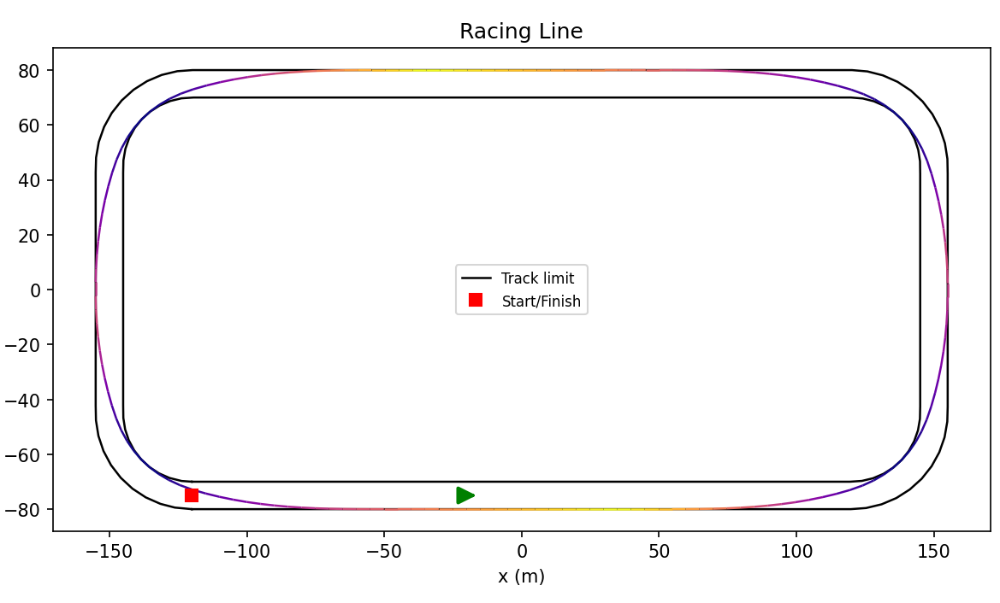

# min-curvature-race-line
A Python library for computing the minimum-curvature racing line on a closed circuit, given a track geometry and a simple vehicle model.



On a racetrack, the path a car takes through a corner has a large effect on lap time. The *minimum-curvature line* is a good approximation to the optimal racing line as it minimizes the integral of squared path curvature subject to staying inside the track boundaries. Because maximum cornering speed scales with the square root of the turn radius, minimizing curvature approximates maximizing average speed, and the resulting line visibly resembles the late-apex lines that skilled racing drivers use.

This library implements that optimization from scratch, along with the supporting machinery needed to turn a track description and a vehicle model into a best lap time estimate (somewhat accurate at this stage).

## Architecture
The library is organized around a one-way data flow:

```
CSV file --> Track --> Optimizer --> Racing line --> Simulator --> Lap result
                         ▲                              ▲
                         │                              │
                     VehicleModel  ─────────────────────┘
```

Each component has a single responsibility and is independently testable:
| Module | Responsibility|
|--------|---------------|
|`track.py`| Track geometry: CSV loading, arc-length resampling, curvature|
|`vehicle.py`| Abstract vehicle model (ABC) interface|
|`point_mass.py`| Concrete point-mass + friction-circle vehicle|
|`optimizer.py`| Minimum-curvature quadratic problem optimization via `cvxpy`|
|`speed_profile.py`| Forward-backward speed-profile pass|
|`simulator.py`| End-2-end integration bridging track + vehicle to lap result|
|`plotting.py`| Visualization with isolated matplotlib dependency|

## Installation
Requires Python 3.12+.

```
git clone https://github.com/YunxuanDeng/min-curvature-race-line.git
cd min-curvature-race-line
python -m venv .venv
source .venv/bin/activate or .venv/Scripts/activate
pip install -e .
```

## Quick start
- As a library: modify and use `optimize_[]` under src/use_example/
- As a CLI: minimally, use `raceline optimize --track [.csv path], --plot [.png]` with default vehicle setup. Refer to `cli.py` for more info.

## Track format
The library reads the TUM racetrack-database CSV format:
```
# x_m, y_m, w_tr_right, w_tr_left
1.0, 2.0, 3.0, 4.0
5.0, 6.0, 7.0, 8.0
...
```
Real-world tracks and circuits (Austin, Silverstone, Monza, etc.) are available from the [TUM racetrack-database](https://github.com/TUMFTM/racetrack-database).

## Vehicle model
The library uses a point-mass vehicle with a friction-circle grip model. The combined lateral and longitudinal acceleration cannot exceed the tire's grip limit given by $\sqrt{a_{lat}^2+a_{long}^2} \le \text{max grip}$. This setup captures the trade-off that you can either brake or corner hard, but usually not both at 100% simultaneously.

Parameters:
- `mass`: Vehicle mass in kg
- `max_grip`: Tire grip limit in $m/s^2$
- `max_engine_acceleration`: Engine acceleration limit in $m/s^2$
- `max_brake_deceleration`: Brake limit in $m/s^2$
- `max_speed`: Top speed in $m/s$

## Running the tests
117 tests cover construction/validation, analytical oracles (circle lap times, cornering speed), constraint compliance, and plotting smoke tests.

## Development
This library used `ruff` and `mypy` for style and type checks.

## Generative AI use
### Tools
Claude (Anthropic) Opus 4.6 extended and 4.7 adaptive was used and accessed via desktop app and web interface.

### How it was used
Claude was used as a collaborative developer throughout the project. Conversations mostly comprised of me describing the development goal, asking about choices of design decisions, and iteratively requesting to refine or debug with Claude's assistance. All code was reviewed, understood, and tested by me before commiting.

## What AI produced
Claude produced code, documentation, and configuration files

### Code
- Initial implementation of main library modules including docstrings, type annotations, and validation logic
- Test files for the modules, having 117 unit tests in total
- `__init__.py` updated at each phase
- Debugging assistance

### Documentation
- `README.md`: project overview, architecture diagram, installation instructions, quick start examples

### Config files
- Update `pyproject.toml` where needed to build system, dependencies, and config for `ruff`, `mypy`, `pytest`
- Modify CI workflow files inherited from `ehr_utils`
